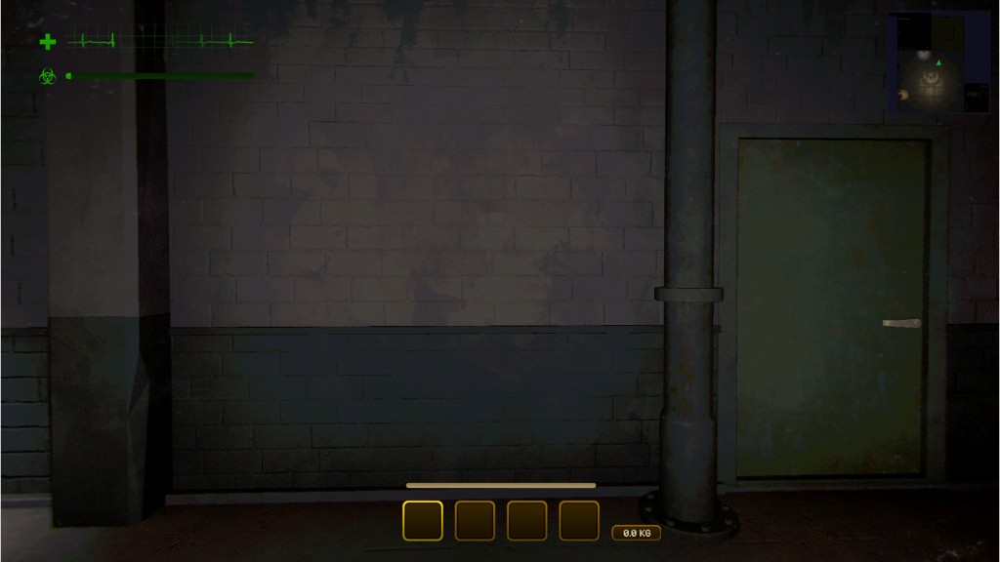
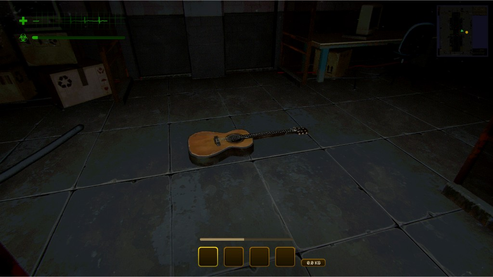

# MimesisMinimap

MIMESIS 向け MelonLoader ミニマップ MOD です。プレイヤー頭上から見下ろす RenderTexture 方式で、敵・味方・アイテムを表示し、ズームや表示切り替えが可能です。





## 必要な環境

- .NET Framework 4.7.2
- Visual Studio 2017 以降（または MSBuild）
- MIMESIS（Steam）の Managed DLL への参照
- MelonLoader（ゲームに導入済み、またはビルド用に `Lib\MelonLoader.dll` を配置）
- ゲームが **Unity Input System** を使用している前提（ズーム操作に使用）

## ビルド手順

1. **ゲームパスの確認**  
   `MimesisMinimap.csproj` の `MIMESIS_MANAGED` を、MIMESIS の `MIMESIS_Data\Managed` フォルダのパスに合わせて編集してください。

2. **MelonLoader.dll の配置**  
   ビルド時に MelonLoader を参照するため、次のいずれかを行ってください。  
   - **Thunderstore Mod Manager 利用時:**  
     `net35\MelonLoader.dll` をコピー（本プロジェクトは .NET Framework 4.7.2 のため net35 を参照）。  
     例: `%AppData%\Roaming\Thunderstore Mod Manager\DataFolder\Mimesis\profiles\Default\MelonLoader\net35\MelonLoader.dll`  
     → `MimesisMinimap\Lib\MelonLoader.dll`  
   - ゲームに MelonLoader を直接入れた場合:  
     `MIMESIS\MelonLoader\MelonLoader.dll`（net35 系）を `MimesisMinimap\Lib\` にコピー。  
   - または、[MelonLoader のリリース](https://github.com/LavaGang/MelonLoader/releases) から取得した **.NET Framework 用** `MelonLoader.dll` を `MimesisMinimap\Lib\` に配置する。

3. **ビルド**  
   ```bat
   msbuild MimesisMinimap.csproj /p:Configuration=Release
   ```
   または Visual Studio / `dotnet build` でソリューションをビルド。

4. **導入**  
   生成された `bin\Release\MimesisMinimap.dll` を  
   `MIMESIS\Mods\` にコピーしてゲームを起動。

## 動作概要

- **画面右上**に 200×200 のミニマップ枠を表示。プレイヤー頭上から真下を見下ろす **Orthographic カメラ**の映像を RenderTexture で表示します。
- **プレイヤー**は常に中央で、進行方向を黄色の矢印で表示。
- **味方**は **緑の三角**、**敵（ミメシス）**は **赤の三角**で表示。AI 専用コンポーネント（`DLAgent.DLMovementAgent` / `DLDecisionAgent`）で敵を判定するため、擬態（ボイスチャット所持）していても正しく赤で表示されます。
- **アイテム**（Value/Price/ScrapValue/ItemValue を持つオブジェクト）は **黄色い丸**で表示。プレイヤー・敵・ドア・自販機・キャラクターの子オブジェクトは除外されます。
- **階層スライス**: プレイヤーの高さ（Y）を基準に、足元 -2m ～ 頭上 +3.5m の範囲のみ表示。上の階・地下のアイテムは表示されず、階段で階が変わるとその階のアイテムだけが表示されます。棚の上（+2～+3.5m）のアイテムは半透明で表示。
- **ズーム**: キーボードの **マイナス（-）** で縮小、**プラス（=）** または **テンキー +**、**Shift + セミコロン（;）**（JIS 配列）で拡大。倍率は 5～100 の範囲で変更可能です（**Unity Input System** 使用）。

## 設定（MelonPreferences）

MelonLoader の設定画面（Mods → MimesisMinimap）から以下を変更できます。

| 項目 | 説明 | 既定値 |
|------|------|--------|
| **ShowEnemies** | 敵（赤三角）を表示する | true |
| **ShowAllies** | 味方（緑三角）を表示する | true |
| **ShowItems** | アイテム（黄色丸）を表示する | true |
| **ZoomStep** | ズーム時の変化量 | 5 |

## プレイヤー位置の取得

次の優先順でローカルプレイヤーの `Transform` を取得しています。

1. **Tag "Player"** の GameObject
2. **Mimic.Actors.ProtoActor** のうち、FishNet の IsOwner 等でローカルと判定されたもの（マルチ対応）
3. **Camera.main** の transform（フォールバック）

## DLL 解析ツール

`AnalyzeDll.ps1` および `analysis_output.txt` は、`Assembly-CSharp.dll` の型・メンバー解析に利用できます。ゲームの Managed フォルダを指定して実行してください。
